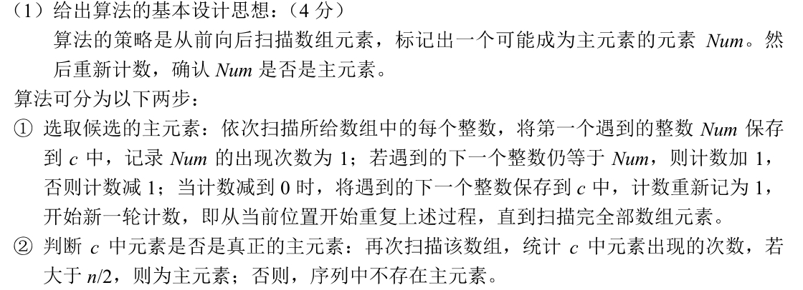

## 2013年408算法题

https://www.codeleading.com/article/31065712792/

## 问题


## 分析



```c++
int find_main(int a[],int N) {
	int temp = -1, num = 0;
	for (int i = 0; i < N; i++) {
		if (temp == a[i]) {
			num++;
		}
		else {
			num--;
			if (num < 0) {
				temp = a[i];
				num = 1;
			}
		}
	}
	num = 0;
	for (int i = 0; i < N; i++) {
		if (temp == a[i]) {
			num++;
		}
	}
	if (num > N / 2) {
		return temp;
	}
	else {
		return -1;
	}
}
```

